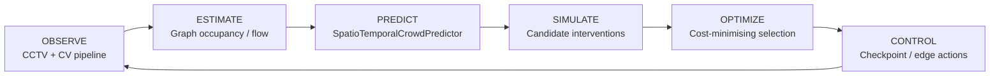
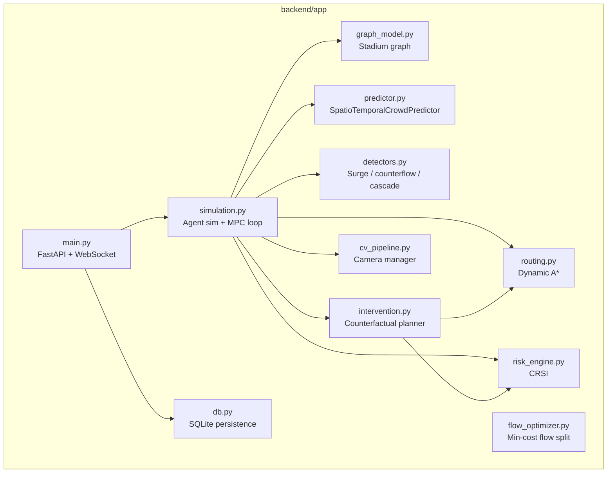
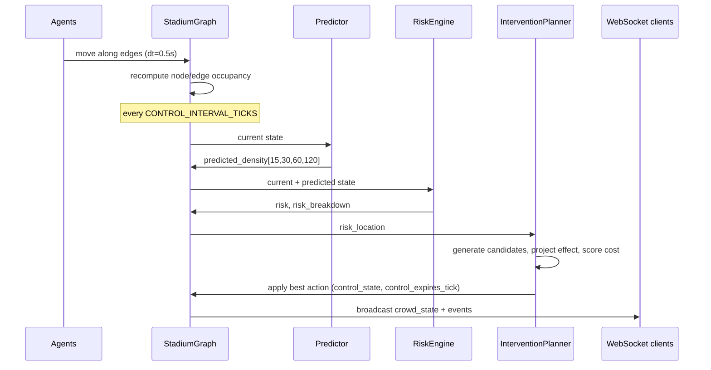

# CrowdShield AI — Architecture

## 1. Control-loop overview

This loop runs every `CONTROL_INTERVAL_TICKS` simulation ticks (~2s) inside
`SimulationEngine._control_cycle()`, independent of any connected client.

## 2. Module map

## 3. Data flow per tick

## 4. Prototype vs. production

| Concern | PROTOTYPE (this repo) | PRODUCTION (future) |
|---|---|---|
| Camera input | 5 pre-recorded MP4s, or SIMULATION FALLBACK if absent | Live RTSP / IP camera streams |
| Detection/tracking | Lightweight OpenCV motion-proxy (background subtraction) blended with simulated ground truth | YOLO + ByteTrack multi-camera fusion, edge-deployed |
| Crowd movement | Agent-based graph simulation (this *is* the "ground truth" the demo shows) | Real people, observed only — never simulated |
| Control actions | Simulated checkpoint state (`control_state` on graph nodes/edges), rendered visually | Smart gates, electronic barricades, digital signage, PA integration |
| Prediction | Hybrid flow-conservation + gradient-boosted regressor (bootstrapped on synthetic trajectories) + graph propagation | Same architecture; regressor retrained continuously on real observed trajectories, GNN upgrade path already isolated behind `SpatioTemporalCrowdPredictor` |
| Persistence | SQLite, single process | Postgres / time-series store, multi-instance |
| Transport | WebSocket to a single FastAPI process | Message bus (Kafka/NATS) fan-out to multiple control-room clients |
| Deployment | `uvicorn` on a laptop | Containerised, edge + cloud hybrid, redundant control loop |

**No claim is made that this prototype prevents stampedes, guarantees
safety, or has been validated for real stadiums.** It is a predictive
simulation and decision-support demonstration, designed to show the
architecture a future live deployment would extend.

## 5. Safety guardrails implemented

- `routing.all_destinations_reachable()` is checked before any `BLOCK_EDGE`
  candidate is even considered by the intervention planner — a route is
  never fully cut off from every exit.
- If no candidate beats `DO_NOTHING` and risk remains high, the system
  emits `NO SAFE AUTOMATIC ACTION — OPERATOR REVIEW REQUIRED` rather than
  inventing a route (`intervention.no_safe_action_decision`).
- Every applied action has a `duration_sec` and is automatically
  re-evaluated for reopening (`SimulationEngine._auto_reopen`) — nothing
  is closed permanently by the optimizer.
- Camera failure degrades gracefully to a neighbour/graph-based estimate
  with an explicit confidence score, never a crash.
